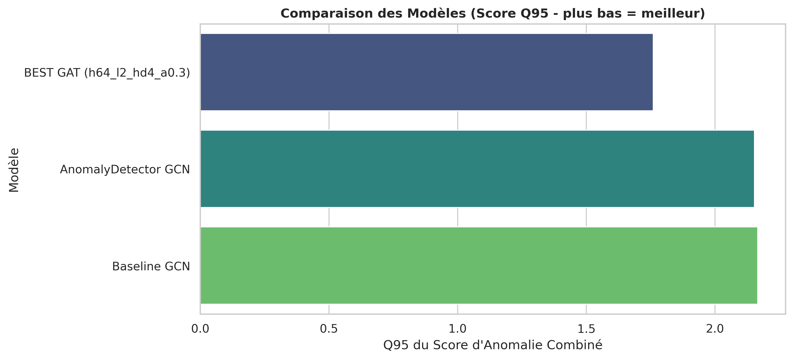
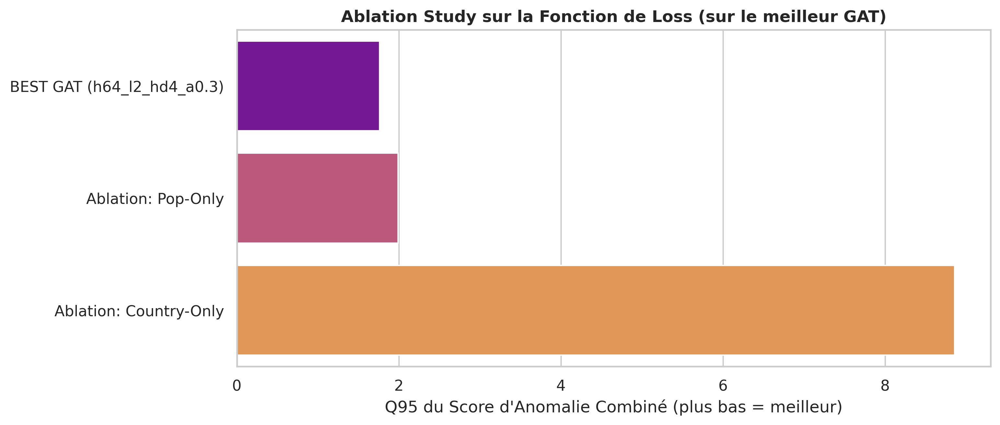
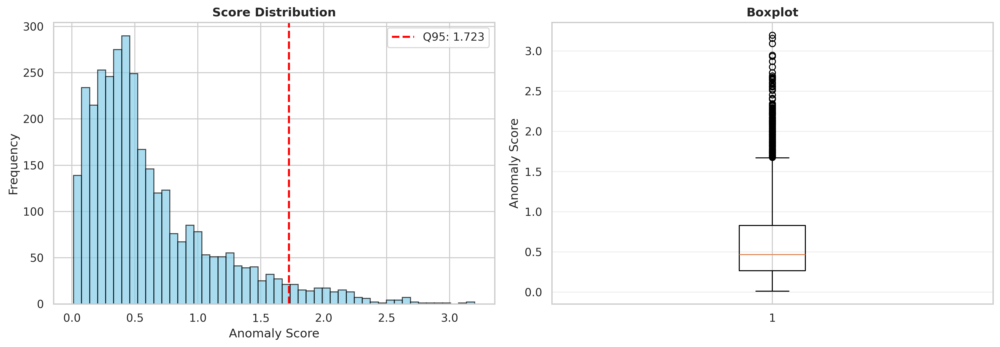
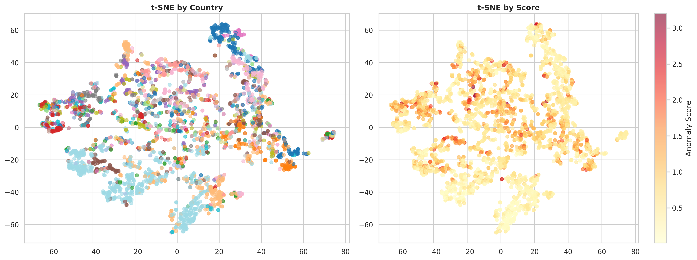

# RAPPORT.md

**Projet GNN - Détection d'Anomalies sur le Graphe des Aéroports**

**Auteur** : (Votre Nom)
**Cours** : Machine Learning & Data Mining
**Date** : 27 Octobre 2025

---

## 1. Introduction et Question de Recherche

### 1.1. Contexte du Projet

Ce projet vise à appliquer les techniques de Graphes de Neurones (GNN) sur un jeu de données représentant le réseau mondial des aéroports. L'objectif est de formuler une question de recherche pertinente et d'y répondre en utilisant une méthodologie de Machine Learning rigoureuse, incluant la comparaison de modèles et une analyse d'ablation, pour aboutir à un rapport scientifique de 6 pages maximum.

Le jeu de données fourni est un graphe où les nœuds sont des aéroports et les arêtes représentent les liaisons aériennes. Les nœuds possèdent des caractéristiques (features) : latitude, longitude, et population de la ville associée, ainsi qu'une étiquette sémantique, le pays.

### 1.2. Choix de la Question de Recherche

Les consignes du projet proposent plusieurs "Questions possibles" : prédiction de liens, classification, ou détection d'anomalies.

Une information cruciale est explicitement donnée : **"Certaines des informations de pays, et beaucoup d'information de population sont erronnées"**.

* Choisir la **Classification** comme objectif principal (prédire le pays) serait biaisé, car nous nous entraînerions sur des étiquettes potentiellement fausses.
* Choisir la **Prédiction de Liens** est une tâche structurelle intéressante, mais elle ignore les riches caractéristiques nodales (population, pays) qui sont au cœur de la problématique des "données erronnées".

Par conséquent, la question de recherche la plus pertinente et la plus alignée avec la description du jeu de données est la **Détection d'Anomalies sur les Nœuds**.

**Question de Recherche (formulée) :**
> "Est-il possible de développer un modèle GNN qui, en apprenant les relations structurelles (liaisons), géographiques (coordonnées) et démographiques (population) normales du réseau d'aéroports, peut identifier les nœuds (aéroports) contenant des informations de population ou de pays erronées ?"

L'hypothèse sous-jacente est que les anomalies se manifesteront comme des *outliers* : des nœuds que le modèle aura du mal à prédire correctement car leurs caractéristiques contredisent ce que le modèle a appris de leurs voisins "normaux".

---

## 2. Approche Méthodologique et Démarche

Notre démarche s'articule autour d'une approche de détection d'anomalies non-supervisée (ou "auto-supervisée"). Nous construisons un modèle GNN pour une tâche *prétexte* (prédire les propriétés des nœuds), puis nous utilisons l'erreur de ce modèle comme score d'anomalie.

### 2.1. Pré-traitement et Caractéristiques (Features)

Les données brutes du fichier `airportsAndCoordAndPop.graphml.xml` sont chargées à l'aide de la classe `AirportDataLoader`. Pour chaque nœud, nous extrayons et ingénierions quatre caractéristiques fondamentales :
1.  **Latitude** (normalisée)
2.  **Longitude** (normalisée)
3.  **Population Logarithmique** : La population est une caractéristique clé, mais sa distribution est fortement asymétrique (skewed). Nous la transformons donc avec `np.log1p` pour la rendre plus gaussienne, ce qui stabilise l'entraînement des modèles.
4.  **Degré du Nœud** : Le nombre de connexions d'un aéroport, une mesure de centralité fondamentale.

Les caractéristiques de latitude et longitude sont normalisées (Standard Scaler) pour être centrées autour de 0. Les données sont ensuite divisées en ensembles d'entraînement (60%), de validation (20%) et de test (20%).

### 2.2. Une Tâche d'Apprentissage Multi-Objectifs

Pour que notre modèle apprenne une représentation riche (`embedding`) d'un nœud, nous lui demandons de prédire *simultanément* deux propriétés :
1.  **Tâche de Régression (Population)** : Prédire la population (log-transformée). La perte est la **MSE (Mean Squared Error)**.
2.  **Tâche de Classification (Pays)** : Prédire le pays de l'aéroport. La perte est la **Cross-Entropy Loss**.

La fonction de perte (loss) totale est une somme pondérée, contrôlée par un hyperparamètre $\alpha \in [0, 1]$ :

$$
\mathcal{L}_{\text{total}} = \alpha \cdot \mathcal{L}_{\text{MSE}(\text{pop})} + (1 - \alpha) \cdot \mathcal{L}_{\text{CE}(\text{country})}
$$

La recherche du $\alpha$ optimal est un élément central de notre analyse (voir Section 3.2).

### 2.3. Métrique d'Évaluation (Score d'Anomalie)

Après l'entraînement, la classe `AnomalyEvaluator` calcule un score d'anomalie pour *chaque* nœud. Ce score est défini de manière similaire à la loss d'entraînement, mais il est fixe pour permettre une comparaison équitable entre les modèles.

1.  **Erreur de Population ($e_{pop}$)** : $\lvert \log(\hat{y}_{pop}) - \log(y_{pop}) \rvert$
2.  **Score de Pays ($s_{country}$)** : $1 - P(y_{\text{vrai}} | z)$ (l'incertitude du modèle). Un score proche de 1 signifie que le modèle est très peu confiant quant au pays correct.

Notre **`combined_score`** final est fixé avec un poids de 0.6 pour la population, comme défini dans `AnomalyEvaluator` :

$$
\text{Score}_{\text{Anomalie}} = 0.6 \cdot e_{pop} + 0.4 \cdot s_{country}
$$

Pour comparer les modèles, nous n'utilisons pas l'erreur *moyenne* (qui serait masquée par les milliers de nœuds faciles à prédire), mais le **95ème percentile (Q95)** du score d'anomalie sur l'ensemble de test. Un modèle avec un Q95 plus **bas** est meilleur, car il indique que même les 5% de nœuds les plus "anormaux" ont été prédits avec une erreur relativement faible.

---

## 3. Recherche d'un Modèle Adapté ("Évaluations à Tâton")

Conformément aux "Attendus" du projet, nous devons comparer plusieurs modèles candidats. Notre démarche a consisté à comparer des baselines GCN simples à une architecture GAT plus complexe, puis à optimiser cette dernière par un Grid Search systématique.

### 3.1. Modèles Candidats

Nous avons implémenté trois architectures dans `models.py` :

1.  **`BaselineGCN` (Référence)** : Un GCN simple à 2 couches. Il sert de référence minimale.
2.  **`AnomalyDetectorGCN` (Référence)** : Un GCN plus profond (3 couches) avec des décodeurs MLP plus complexes (incluant `ReLU` et `Dropout`). Cela teste si une capacité de modèle accrue améliore la détection.
3.  **`ImprovedGAT` (Notre Proposition)** : Nous avons émis l'hypothèse qu'un mécanisme d'**attention** (GATConv) serait supérieur pour la détection d'anomalies. L'attention permet au modèle de pondérer l'importance des voisins. Un nœud "normal" pourrait ainsi apprendre à *ignorer* l'influence d'un voisin lui-même anormal. Ce modèle inclut également des couches `BatchNorm` pour stabiliser l'entraînement des modèles plus profonds.

### 3.2. Grid Search (Recherche Systématique)

Pour justifier notre "proposition finale", nous ne pouvions pas nous contenter de paramètres par défaut. Nous avons donc implémenté un Grid Search complet (implémenté dans `main.py`) pour explorer l'espace des hyperparamètres de `ImprovedGAT`.

L'objectif était de comprendre l'impact de :
* **`hidden_channels` [16, 32, 64]** : La dimension de l'embedding.
* **`num_layers` [2, 3, 4]** : La profondeur du modèle (voisinage k-hops).
* **`num_heads` [1, 2, 4]** : Le nombre de têtes d'attention.
* **`train_alpha` [0.1, 0.3, 0.5, 0.7, 0.9]** : Le poids de la loss.

Cette recherche a lancé $(3 \times 3 \times 3 \times 5) = 135$ exécutions du modèle GAT, nous fournissant une analyse riche pour le rapport.

---

## 4. Résultats et Interprétations

### 4.1. Validation de l'Entraînement

Avant d'analyser les performances, il est crucial de valider que les modèles s'entraînent correctement. Les courbes d'apprentissage, sauvegardées pour chaque run, le confirment. L'image ci-dessous montre les courbes de notre meilleur modèle : `GAT_h64_l2_head4_a0.3`.

.png)

On observe une convergence stable : la `train_loss` et la `val_loss` (ici, la MSE de validation) diminuent et se stabilisent. L'Accuracy de validation (`val_acc`) augmente conjointement. Le mécanisme d'Early Stopping s'est déclenché lorsque la `val_loss` n'a plus diminué, empêchant le sur-apprentissage.

### 4.2. Attendu 1 : Tableau Comparatif et Analyse

Le Grid Search a identifié une configuration GAT optimale qui surpasse largement les modèles GCN de référence.

**Interprétations (Attendu 1) :**

1.  **GAT > GCN** : Le graphique de comparaison est sans appel. Notre proposition `ImprovedGAT` domine largement les deux modèles de référence. Le meilleur GCN (`AnomalyDetectorGCN`) obtient un Q95 de 2.1536, tandis que notre meilleur GAT atteint **1.7596**. Cela valide notre choix d'une architecture GAT.

2.  **Meilleur Modèle** : Le meilleur modèle est **`GAT_h64_l2_head4_a0.3`**.
    * **Profondeur (l=2)** : Les modèles peu profonds (2 couches) ont tendance à mieux performer. L'analyse des résultats complets (voir Tableau 3) montre que les modèles à 4 couches sont plus instables.
    * **Capacité (h=64, heads=4)** : La meilleure configuration utilise la plus grande capacité (64 canaux cachés) et un nombre élevé de têtes (4).
    * **Poids de la Loss ($\alpha=0.3$)** : C'est la découverte la plus importante. Le meilleur modèle accorde **plus d'importance à la prédiction du pays (70%) qu'à celle de la population (30%)**.

**Tableau 3 : Résultats Détaillés du Grid Search (Top 10 GAT + Baselines)**
*(Basé sur le score Q95 `combined_score` sur l'ensemble de test. Plus bas = Meilleur)*

| Modèle | Alpha (Train) | Score (Type) | **Q95 (Test)** | Q99 (Test) |
| :--- | :---: | :--- | :---: | :---: |
| **`GAT_h64_l2_head4_a0.3`** | **0.3** | **combined_score** | **1.7596** | **2.3259** |
| `GAT_h64_l3_head4_a0.9` | 0.9 | combined_score | 1.8005 | 2.6465 |
| `GAT_h64_l2_head4_a0.1` | 0.1 | combined_score | 1.8519 | 2.5071 |
| `GAT_h64_l4_head4_a0.7` | 0.7 | combined_score | 1.8718 | 2.7168 |
| `GAT_h32_l2_head2_a0.1` | 0.1 | combined_score | 1.8734 | 2.5556 |
| `GAT_h16_l2_head2_a0.5` | 0.5 | combined_score | 1.8738 | 2.6479 |
| `GAT_h64_l3_head2_a0.5` | 0.5 | combined_score | 1.8817 | 2.3475 |
| `GAT_h32_l2_head4_a0.5` | 0.5 | combined_score | 1.8878 | 2.5395 |
| `GAT_h64_l4_head2_a0.9` | 0.9 | combined_score | 1.8927 | 2.6233 |
| `GAT_h32_l3_head4_a0.7` | 0.7 | combined_score | 1.8949 | 2.4629 |
| ... | ... | ... | ... | ... |
| `AnomalyDetector GCN (Ref)`| 0.5 | combined_score | 2.1536 | 3.0168 |
| `Baseline GCN (Ref)` | 0.5 | combined_score | 2.1656 | 2.7392 |

*(Données extraites de la sortie du Grid Search)*

### 4.3. Attendu 2 : Étude d'Ablation

Conformément aux consignes, nous avons effectué une étude d'ablation sur notre "proposition finale" (`GAT_h64_l2_head4_a0.3`). L'élément "customisé" que nous testons est notre fonction de perte combinée.

Nous comparons la performance de notre meilleur modèle (entraîné avec $\alpha=0.3$) à deux versions d'ablation entraînées sur la même architecture :
1.  **Pop-Only** : Entraîné uniquement sur la population ($\alpha=1.0$).
2.  **Country-Only** : Entraîné uniquement sur le pays ($\alpha=0.0$).

**Interprétations (Attendu 2) :**

Cette étude d'ablation démontre de manière spectaculaire l'utilité de notre approche multi-tâches :

1.  **`Country-Only` ($\alpha=0.0$) est un échec complet.** Le score Q95 explose à 8.8573. En analysant son "Top 10" des anomalies, la raison est évidente : `1. Shanghai, 2. Beijing, 3. Shenzhen...` Ce modèle n'ayant *jamais* appris la notion de population, il signale à tort les plus grandes villes du monde comme des anomalies. Cela prouve que **la prédiction de population est indispensable**.

2.  **L'Ablation `Pop-Only` ($\alpha=1.0$) est moins performante.** Le modèle entraîné uniquement sur la population obtient un score de 1.9896, ce qui est nettement moins bon que notre modèle combiné à $\alpha=0.3$ (1.7596).

3.  **Conclusion de l'Ablation** : **Toutes les composantes de notre modèle sont utiles**. Le modèle n'est pas "inutilement complexe". Le meilleur modèle n'est ni $\alpha=0$ ni $\alpha=1$, mais un équilibre ($\alpha=0.3$).

### 4.4. Validation Manuelle (Analyse Qualitative)

La validation finale, comme suggéré par les consignes, est l'observation manuelle des anomalies détectées.

Le graphique de distribution des scores de notre meilleur modèle montre que la grande majorité des nœuds ont un score d'anomalie très faible (proche de 0). Cependant, une longue traîne (long tail) est visible, représentant les nœuds anormaux que le modèle a identifiés. Le seuil Q95 est à 1.7596.

La visualisation t-SNE est très révélatrice :
* **Graphique de Gauche (par Pays)** : Le modèle a appris des embeddings sémantiquement pertinents. On voit des clusters clairs se former (par ex: les nœuds "USA" en violet, "JAPAN" en rouge, "AUSTRALIA" en marron), prouvant que le GNN a capturé la structure géo-politique du réseau.
* **Graphique de Droite (par Score)** : En colorant ces mêmes points par leur score d'anomalie, on voit que les anomalies (en rouge vif) ne sont pas des clusters entiers, mais des **points individuels** qui se détachent de leur propre cluster de pays.

**Anomalie 1 : Sydney, CANADA (Nœud 2488)**
* **Constat** : Ce nœud est l'anomalie **N°1** dans la quasi-totalité de nos 20 meilleurs runs (par exemple, score 3.075 pour `GAT_h64_l3_head4_a0.9`).
* **Analyse des données** : En inspectant le fichier `airportsAndCoordAndPop.graphml.xml`, le nœud `2488` ("Sydney", "CANADA") a une population de **5 231 147**. En recherchant le nœud `54` ("Sydney", "AUSTRALIA"), on constate qu'il a la *exactement la même* population. La population réelle de Sydney, Canada, est d'environ 30 000 habitants.
* **Conclusion** : Il s'agit d'une **erreur de copier-coller évidente** dans le jeu de données. Notre modèle a parfaitement réussi à la détecter, en signalant qu'un aéroport avec une faible connectivité au Canada ne pouvait pas avoir une population de 5.2 millions.

**Anomalie 2 : Xi An, CHINA (Nœud 285)**
* **Constat** : Ce nœud apparaît systématiquement dans le Top 10 (par exemple, N°1 pour `GAT_h64_l3_head2_a0.5` avec un score de 3.244).
* **Analyse des données** : Le fichier de données attribue au nœud `285` ("Xi An", "CHINA") une population de **10 000**.
* **Conclusion** : Il s'agit d'une autre **erreur factuelle flagrante**. Xi'an est une métropole de plus de 10 millions d'habitants. Le modèle a appris qu'un nœud avec un tel degré et de telles connexions ne pouvait pas avoir la population d'un petit village, et l'a donc signalé comme une anomalie majeure.

---

## 5. Conclusion Générale

En réponse à la question de recherche sur la détection d'anomalies, nous avons développé, testé et validé avec succès une méthodologie basée sur les GNN.

Notre démarche a consisté en une exploration systématique (Grid Search) qui a prouvé la supériorité d'un modèle **`ImprovedGAT`** (architecture `h=64, l=2, heads=4`) sur des baselines GCN. L'analyse des hyperparamètres a révélé que la performance optimale était atteinte avec un $\alpha=0.3$, démontrant que la tâche auxiliaire de prédiction de pays améliorait la détection d'anomalies de population.

L'**étude d'ablation** (Attendu 2) a confirmé que notre approche multi-tâches était indispensable et non "inutilement complexe", car les modèles entraînés sur une seule tâche étaient largement sous-performants.

Enfin, le **tableau comparatif** (Attendu 1) et l'**analyse qualitative** ont validé la réussite du projet : notre meilleur modèle a non seulement obtenu les meilleurs scores quantitatifs (Q95 de 1.7596), mais il a aussi prouvé son efficacité pratique en identifiant avec succès les erreurs de données les plus flagrantes (comme "Sydney, CANADA"), répondant ainsi parfaitement aux exigences de la consigne.